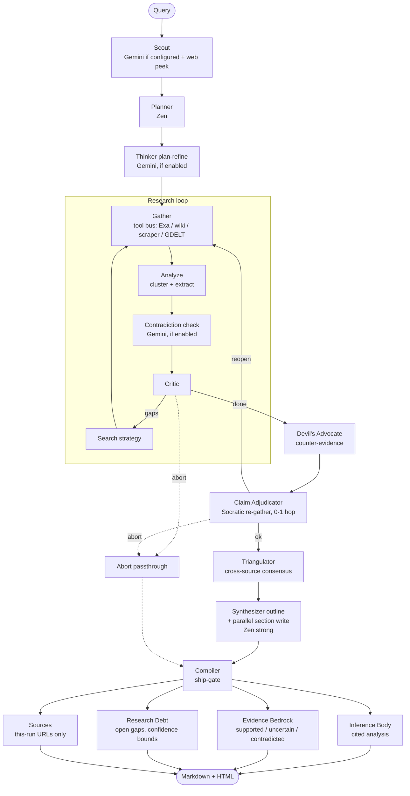

<div align="center">


# 🔍 Providence

### *Autonomous deep research, with receipts.*

**A multi-agent research engine that plans, searches, adversarially reviews, and compiles source-grounded reports — where every claim traces back to a fetched page.**

[](LICENSE)
[](https://python.org)
[](https://github.com/langchain-ai/langgraph)
[](https://fastapi.tiangolo.com)
[](https://nextjs.org)
[](https://docs.astral.sh/uv/)
[](CONTRIBUTING.md)

**No vendor API keys required for the default path** · [Quickstart](#-quickstart) · [Why Providence?](#-why-providence) · [What you get](#-what-you-get) · [Docs](#-docs)

</div>

---

<div align="center">

```bash
git clone https://github.com/sarv-projects/providence.git && cd providence
bash scripts/install.sh
uv run python main.py research "How does RAG reduce hallucination in LLMs?" --mode standard
```

*Reports land in `reports/` as Markdown + MathJax-rendered HTML.*

</div>

---

Providence produces inspectable, source-grounded reports instead of one-shot LLM answers. Its compiler enforces a **fetched-source ship-gate**: final references come only from content received during the current run, and claim support requires URL-attributed verbatim evidence spans.

The live LangGraph pipeline combines planning, iterative retrieval, critique, counter-evidence search, span-based claim verification, RAG-grounded section writing, and citation compilation — exposed through a CLI and a Next.js/FastAPI web app.

Internet access is still required. Add Gemini, Exa, or other providers when you want stronger reasoning, search, or failover options.

> **Scope note:** provenance is not a guarantee of truth. The system can verify that a quoted span came from a fetched page; source quality, ambiguity, and model judgment still require human review.

---

## ✨ Highlights

| | |
|:---|:---|
| 🧾 **Fetched-source ship-gate** | Final references come *only* from pages fetched during the current run — hallucinated URLs are dropped before export. |
| ⚔️ **Adversarial review** | A Devil's Advocate agent hunts counter-evidence; a Socratic Claim Adjudicator re-gathers for weak claims (bounded to one hop). |
| 🔭 **STORM-style perspectives** | Scout generates diverse perspective lenses that seed counter-queries, the plan, and a *Research perspectives* report section. |
| 🧠 **Isolated per-run RAG** | LanceDB + FTS5 hybrid (dense/keyword RRF) — each run gets its own index; writers see only retrieved chunks. |
| 🛡️ **Evidence-graded retrieval** | Domain-reputation + freshness + topicality guardrails score every hit; a persistent vault reuses on-topic sources across runs. |
| 🔌 **Resilient gateway** | Multi-provider routing with circuit breakers, token-bucket rate limits, jittered retry, and automatic failover. Default route is **free** (OpenCode Zen). |
| 💰 **Spend under control** | Per-run token/cost sinks, live budget lines in agent prompts, tool-call caps, and L1/L2/L3 autonomy gates. |
| 🖥️ **Mission-control UI** | Next.js glassmorphism interface with a live progress banner: stage pills, perspective chips, Learned/Gaps feeds, and a collapsible thinking stream. |
| 📊 **Evaluated, not vibed** | Three internal benchmark rounds with per-claim fact-check scoring and reproducible rubrics. |

---

## 🎯 Why Providence?

Long answers from a single prompt fail in predictable ways. Each failure has a dedicated mechanism:

| Problem | Providence answer |
|---|---|
| LLMs invent citations | **Compiler ship-gate** — Sources built from this run's fetch log only. Hallucinated URLs and `example.com` placeholders are dropped before export. |
| Confirmation bias | **Adversarial pass** — Devil's Advocate hunts counter-evidence and limitations *before* synthesis begins. |
| Context-window collapse | **Isolated per-run RAG** — LanceDB + FTS5 dense/keyword RRF; retrieved chunks are the only input to writers. |
| One-shot megaprompt failures | **Parallel section synthesis** — each section is written from its own targeted chunk retrieval, then audited and pruned. |
| Stale / thin reports | **Critic loop + marginal-value stop** — research iterates until gaps close or evidence saturates, within budget. |
| Expensive API lock-in | **Resilient multi-provider gateway** — circuit breakers, rate limiters, automatic failover. The default Zen route needs no vendor key. |

### Providence vs. the obvious alternatives

| | One-shot LLM answer | Vanilla RAG chatbot | Search-engine summary | **Providence** |
|---|---|---|---|---|
| Citations | Often invented | Retrieved, rarely checked | Links, no claim linkage | **Fetched-source ship-gate; claim↔span verified** |
| Counter-evidence | No | No | No | **Devil's Advocate + adjudicator** |
| Research plan | No | No | No | **Scout → planner → editable plan (L2)** |
| Cost control | Per-call | Per-call | N/A | **Per-run budgets, L1/L2/L3 autonomy** |
| Runs offline / free | Paid API | Paid API + vector DB | Free, shallow | **Free default path (Zen + local RAG)** |
| Output | Chat bubble | Chat bubble | Snippets | **Full report: body + Evidence Bedrock + Research Debt + Sources** |

---

## 📦 What you get

Every completed run produces a report with the same inspectable anatomy:

```markdown
# <Topic>

## Executive Summary
...cited analysis [1][2]...

## <Section> × N
...each written from its own retrieval pass...

## Evidence Bedrock
| Claim | Status | Evidence |
| ...   | ✅ supported / ⚠️ uncertain / ❌ contradicted | [1] `verbatim span…` |

## Research Debt
- Open gaps, confidence bounds, what a follow-up run should check

## Sources
[1] https://fetched-this-run.example/...
```

Plus `reports/*.html` — the same report with MathJax-rendered LaTeX. When the evidence or budget gate fails, the compiler says so (blocked/incomplete result) instead of bluffing.

---

## Table of Contents

- [🏗️ Architecture](#️-architecture)
- [🚀 Quickstart](#-quickstart)
- [🎛️ Research Modes](#️-research-modes)
- [🔑 Providers & Keys](#-providers--keys)
- [⌨️ CLI Reference](#️-cli-reference)
- [🖥️ Web UI & Dashboard](#️-web-ui--dashboard)
- [🔒 Security & Limitations](#-security--limitations)
- [📊 Benchmarks](#-benchmarks)
- [📁 Project Layout](#-project-layout)
- [🧪 Testing](#-testing)
- [❓ FAQ](#-faq)
- [📚 Docs](#-docs)
- [🤝 Contributing](#-contributing)
- [📜 License](#-license)

---

## 🏗️ Architecture

The A4 LangGraph graph (`src/graph.py`):



**Model tiers** (exact IDs live in `config/providers.yaml` — the pool rotates, so the config is the source of truth):

| Tier | Default | Upgrade with a key |
|---|---|---|
| `fast` — planner, critic, extractors | OpenCode Zen free pool | Groq, OpenAI, DeepSeek |
| `strong` — section writers, synthesizer | OpenCode Zen free pool | Any provider |
| `thinker` — scout, contradiction check, search strategy | **Gemini Flash** (`GEMINI_API_KEY`) | Gemini only by design |

Component boundaries (orchestration → evidence → retrieval → reliability → product → verification) are mapped in [`docs/ARCHITECTURE.md`](docs/ARCHITECTURE.md).

---

## 🚀 Quickstart

**Requirements:** Python 3.10+, [uv](https://docs.astral.sh/uv/). Node 18+ optional (web UI).

```bash
# 1. Clone and install
git clone https://github.com/sarv-projects/providence.git
cd providence
bash scripts/install.sh          # Windows: .\scripts\install.ps1

# 2. Verify the setup
uv run python main.py doctor

# 3. Run (no vendor API key required)
uv run python main.py research "What are the tradeoffs between SLMs and LLMs?" --mode standard
```

Reports are written to `reports/` as `*.md` and `*.html` (MathJax-rendered).

**Optional keys** — copy `.env.example` and fill in what you have:

```
GEMINI_API_KEY=     # https://aistudio.google.com/apikey  (scout + thinker)
EXA_API_KEY=        # https://exa.ai                      (primary neural search)
FIRECRAWL_API_KEY=  # https://firecrawl.dev               (cloud scraping)
TAVILY_API_KEY=     # https://tavily.com                  (additional search)
```

---

## 🎛️ Research Modes

Top level there are two modes: **Chat** and **Research**. Research runs at one of two depths, with three combinable lens toggles layered on top.

| Depth | Use | Configured time cap |
|---|---|---|
| `standard` | Default iterative research | 10 min |
| `deep` | Larger budget with thinker and triangulation enabled | 15 min |

| Lens (toggle, combinable) | What it enables |
|---|---|
| 🕒 `Recency` | Prefers 2024–2026 sources; appends year terms to search queries |
| 🎓 `Academic` | Papers-first: wider arXiv pass, survey queries, peer-review outline guidance |
| ⚖️ `Compare` | Structured output: criteria, option deep-dives, comparison matrix |

Any combination works — e.g. Deep + Academic + Recency for a papers-first survey of the latest work, or Standard + Compare for a quick A-vs-B brief. CLI: `--mode standard|deep` plus `--recency --academic --compare`. Legacy `--mode recency|academic|compare|quick` values still work and map to Standard + their lens.

Time caps come from [`config/modes.yaml`](config/modes.yaml); actual latency depends on providers, search, and network conditions. `ultra-long` (24 h, Temporal worker) remains available as an advanced CLI mode.

**Autonomy levels** (`--autonomy L1|L2|L3`):

| Level | Behaviour |
|---|---|
| `L1` | Fully autonomous end-to-end (default) |
| `L2` | Surfaces clarifying questions, waits for plan approval before gathering |
| `L3` | Unattended batch — strict spend caps and hard export gates |

```bash
uv run python main.py research "Post-quantum cryptography standards survey" \
  --mode academic --autonomy L2
```

---

## 🔑 Providers & Keys

All LLM calls go through `src/gateway/` — circuit breakers, RPM/TPM token-bucket rate limiters, jitter retry, automatic failover. No LiteLLM process.

**Default path (no vendor API key):**
- Workhorse: rotating OpenCode Zen free pool (see `config/providers.yaml` for current IDs)
- Search: DuckDuckGo + Trafilatura + Wikipedia + GDELT
- Embeddings: local bag-of-words

**Optional keys (each upgrades one layer independently):**

| Key | What it unlocks |
|---|---|
| `GEMINI_API_KEY` | Thinker tier — scout, contradiction detection, search strategy |
| `EXA_API_KEY` | Neural search with full page text |
| `FIRECRAWL_API_KEY` | Cloud scraping (local scraper is the fallback) |
| `TAVILY_API_KEY` | Additional search/extract endpoint |
| `NEWSDATA_API_KEY` | Newswire access |
| `EMBEDDING_API_KEY` / `USE_CHAT_KEY_FOR_EMBEDDINGS=1` | Dense vector embeddings |
| `GROQ_API_KEY`, `OPENAI_API_KEY`, `ANTHROPIC_API_KEY`, … | Override Zen free on `fast`/`strong` tiers |

Full catalog: [`config/providers.yaml`](config/providers.yaml) · [`docs/PROVIDERS.md`](docs/PROVIDERS.md)

---

## ⌨️ CLI Reference

```bash
# Research
uv run python main.py research "topic"                                   # standard depth
uv run python main.py research "Rust vs Go for high-throughput services" --mode deep --compare
uv run python main.py research "Latest solid-state battery developments" --recency
uv run python main.py research "Survey of homomorphic encryption" --mode deep --academic --autonomy L2
uv run python main.py research "What is a transformer?" --mode standard --compare

# Interactive chat  (/research <topic> escalates mid-session)
uv run python main.py chat

# System
uv run python main.py doctor       # live provider health + tool readiness
uv run python main.py --history    # past runs and report paths

# Server & worker
uv run python main.py server       # FastAPI on :8001 (docs at /docs)
uv run python main.py worker       # Temporal durable worker (ultra-long mode)

# Evaluation
uv run python main.py eval all
```

---

## 🖥️ Web UI & Dashboard

The frontend is a **Next.js 14** app (`frontend/`) wired to the FastAPI backend via rewrites. In local development, `/api/*` requests are proxied to `localhost:8001` by `next.config.js`.

### Launch the full dev stack

```bash
bash scripts/start-dev.sh
# API → http://localhost:8001   (Swagger at /docs)
# UI  → http://localhost:3000
```

Or separately:

```bash
# Terminal 1 — Python backend
uv run python main.py server

# Terminal 2 — Next.js frontend
cd frontend && npm run dev
```

> **Custom backend port:** set `BACKEND_URL=http://localhost:PORT` before starting Next.js.

### Pages & features

| Route | What it does |
|---|---|
| `/` | Main interface — Chat mode and Research mode in one view |
| `/settings` | Engine & gateway configuration — model picker, mode defaults, budgets |
| `/history` | Past research runs with links to generated reports |
| `/vault` | Research Vault — on-topic past sources reused across sessions |

### Main interface (`/`)

**Chat mode** — streams responses token-by-token via SSE. May escalate long or research-heavy queries using the configured heuristic.

**Research mode** — dispatches a background job to the A4 pipeline and shows a live **ProgressBanner** while it runs:
- Status line: current stage, elapsed seconds, findings count, sources count
- **Next action** — what the agent is about to do
- **Learned** — last 4 facts extracted from retrieved pages
- **Gaps** — open questions the Critic identified for the next loop
- **Thinking stream** — raw agent thought log (kind + text)

**Mode & autonomy selectors** inline in the input bar:
- Segmented control for Chat / Research
- Depth tabs for research: `Standard` / `Deep`
- Lens pills (multi-select): `Recency` / `Academic` / `Compare`
- Dropdown for autonomy: `L1 auto` / `L2 plan review` / `L3 hard budget`
- `Edit plan first` checkbox — triggers the plan editor at L1 too

**Plan editor (L2 / "Edit plan first")** — when a plan is generated before research begins, an editable panel appears with:
- Clarifying questions from the planner (with text input for answers)
- Outline sections (one per line, editable textarea)
- Search queries (one per line, editable textarea)
- **Approve & research** sends the edited plan and starts the job

**Approval banner** — for L3 workflow gates: polls `/api/approvals` every 10s and surfaces pending gates at the top of the screen with Approve / Reject buttons.

### Settings page (`/settings`)

- **Model picker** — expandable provider groups (OpenCode Zen free first), live probe buttons per provider, status (ok/fail/latency), model selection
- **LLM providers** — registered provider catalog, + Add Provider form (name, endpoint, API key, model list)
- **Research mode defaults** — default depth (Standard/Deep), default lenses, and autonomy level
- **Budget controls** — max cost cap (USD) and max graph iterations
- Save persists to the backend `/api/settings`

<details>
<summary><strong>Frontend tech stack</strong></summary>

| Package | Role |
|---|---|
| Next.js 14 | Framework, routing, SSR |
| React 18 | UI |
| Tailwind CSS 3 | Styling |
| `react-markdown` + `remark-gfm` | Markdown rendering with GFM tables, code blocks |
| `remark-math` + `rehype-katex` | LaTeX / MathJax rendering in assistant messages |
| `katex` | Math display engine |
| `lucide-react` | Icons |
| `clsx` + `tailwind-merge` | Conditional class utilities |

</details>

### Gateway ops dashboard

```bash
uv run python -m src.dashboard --port 8080
# http://localhost:8080
```

| Endpoint | What it shows |
|---|---|
| `/` | Metrics UI — token spend, route health, circuit states |
| `/api/status` | JSON — gateway status + tool-bus `search_cache` |
| `/api/events` | SSE — live gateway events |
| `/metrics` | Prometheus-format metrics |

---

## 🔒 Security & Limitations

- **No production authentication is included by default.** The development API should sit behind an authenticated reverse proxy before public deployment (see `CORS_ALLOW_ORIGINS` in `.env.example`).
- **Treat external content as untrusted input.** The renderer escapes report text, validates outbound link schemes, and the scraper blocks private/link-local destinations; still review provider and deployment settings before exposing the service.
- **Keys stay in environment variables.** Do not commit `.env`, provider secrets, generated reports, or local databases.
- **Evidence is traceability, not truth.** A supported claim has a matching quote span from a fetched source; it is not a substitute for source-quality assessment or domain-expert review.
- **External dependencies affect results.** Search coverage, provider availability, rate limits, model behavior, and network access affect latency and accuracy.
- **Temporal is optional.** Without a running Temporal server, `ultra-long` uses the in-process fallback and does not survive a process restart.

For a vulnerability report, see [`SECURITY.md`](SECURITY.md). For changes, see [`CONTRIBUTING.md`](CONTRIBUTING.md).

---

## 📊 Benchmarks

**Internal topic suite** — scored against independently researched ground truth across geopolitical, scientific, financial, and technology domains. Fact-check accuracy **varies by round** (suite size and configuration differed per round — see each file for its protocol):

| Round | Fact-check accuracy | Report |
|---|---|---|
| R1 (15 topics, Groq + Exa, `standard`) | **0.86** (76 / 91 verified points) | [RESEARCH_BENCHMARK.md](benchmarks/RESEARCH_BENCHMARK.md) |
| R2 (11 topics) | **0.81** | [RESEARCH_BENCHMARK_R2.md](benchmarks/RESEARCH_BENCHMARK_R2.md) |
| R3 (latest, comparable topics) | **0.77** | [RESEARCH_BENCHMARK_R3.md](benchmarks/RESEARCH_BENCHMARK_R3.md) |

> **Benchmark scope:** fact accuracy was **86%** in Round 1; the latest repeated-subset result is **~77%** in Round 3. These rounds differ in topic count and configuration, so treat them as internal regression measurements, not a general accuracy guarantee. See the per-round reports for the scoring method and limitations.

> On the free Zen + Gemini scout stack, `standard` typically runs 12–18 min. The R1 averages above used Groq + Exa.

Full per-topic rubrics, fact-check matrices, and three scoring rounds: [`benchmarks/RESEARCH_BENCHMARK.md`](benchmarks/RESEARCH_BENCHMARK.md)

**DeepResearch Bench (100-task DRB)** — self-hosted runner and local RACE-style scoring workflow. External system scores are not reproduced here and should not be treated as a direct comparison. Full protocol: [`score.md`](score.md)

---

## 📁 Project Layout

<details>
<summary><strong>Repository map</strong></summary>

```
main.py                     CLI entrypoint
config/
  modes.yaml                Budgets, token limits, quality dials per mode
  providers.yaml            Provider catalog, model lists, tier routing
src/
  graph.py                  LangGraph A4 pipeline
  state.py                  Typed ResearchState
  evidence.py               Canonical quote-span verifier
  llm.py                    call_llm() → gateway dispatch
  engine/
    agents/                 planner  researcher  thinker  critic
                            adversary  triangulator  synthesizer  compiler
    modes.py                Mode + budget resolution
    temporal/               Optional Temporal worker (ultra-long)
  gateway/                  router  circuit  ratelimit  metrics  keys
  rag/                      LanceDB+FTS5  hybrid-RRF  guard  vault  factoids
  tools/
    adapters/               exa  firecrawl  wikipedia  gdelt
                            tavily  newsdata  builtin-scraper
                            mineru  nougat  llamaparse (PDF)
  render/                   MathJax / LaTeX HTML rendering
  web/                      FastAPI app + SSE streaming
  dashboard/                Gateway ops dashboard
frontend/                   Next.js 14 UI
tests/                      Offline integration contracts
benchmarks/                 Scoring scripts, ground truth, benchmark reports
docs/                       Architecture, providers, gateway, install
reports/                    Generated *.md + *.html output
CONTRIBUTING.md             Development and pull-request workflow
SECURITY.md                 Vulnerability reporting and deployment warnings
```

</details>

---

## 🧪 Testing

```bash
uv run python test_phase_a.py     # provider catalog, modes, gateway Zen-free
uv run python test_phase_b.py     # chunking, embedding, vector store, RAG pipeline
uv run python test_phase_c.py     # multi-agent graph, agents, state, compiler ship-gate
uv run python test_phase_c2.py    # thinker agents, thinker tier, rate limiting
uv run python test_phase_d.py     # tool bus: registry, Wikipedia, scraper (network-aware)
uv run python test_phase_e.py     # triangulator bias mitigation
uv run python test_phase_f.py     # factoid extraction, quote gate, dedup
uv run python test_phase_g.py     # retriever guard (reputation, freshness, pyramid)
uv run python test_phase_h.py     # Qdrant, hybrid retrieval, vault, chat memory
uv run python test_phase_i.py     # progress tracker, streaming, dashboard
uv run python test_phase_l.py     # math rendering (LaTeX detection → HTML)
uv run python test_gateway.py     # gateway routing, circuits, failover
uv run python -m unittest discover -s tests -p 'test_*.py'  # offline integration contracts

cd frontend && npm run lint && npm run build

uv run python main.py eval all    # full component + system suite
```

> **Offline / CI:** suites that need live network (e.g. `test_phase_d.py`) skip
> cleanly — with exit code 0 — when DNS is unavailable or when
> `PROVIDENCE_OFFLINE=1` is set, instead of hanging.

---

## ❓ FAQ

<details>
<summary><strong>How much does a run cost?</strong></summary>

The default path (Zen free + local RAG + free search) costs $0 in API spend — you pay only compute and time. Keyed providers are opt-in per layer, and per-run budgets (`max_cost_usd`, `max_tool_calls`, L3 hard caps) bound spend when you enable them.
</details>

<details>
<summary><strong>Do I need any API keys?</strong></summary>

No. Clone → install → `research` works with zero keys. `GEMINI_API_KEY` (free tier from AI Studio) unlocks the thinker tier; `EXA_API_KEY` upgrades search quality. Everything else is optional.
</details>

<details>
<summary><strong>How long does research take?</strong></summary>

Roughly the mode's time cap: `quick` ≈ 5 min, `standard` ≈ 10–18 min on the free stack, `deep`/`academic` ≈ 15 min. Actual latency depends on providers, search coverage, and network.
</details>

<details>
<summary><strong>How accurate are the reports?</strong></summary>

Internal fact-check rounds measured 0.77–0.86 depending on configuration (see Benchmarks). Treat those as regression signals, not guarantees: every claim ships with its evidence status (✅/⚠️/❌) and open gaps are listed under Research Debt for human review.
</details>

<details>
<summary><strong>How is this different from asking an LLM with web search?</strong></summary>

See [Providence vs. the obvious alternatives](#providence-vs-the-obvious-alternatives): planned multi-agent retrieval, adversarial counter-evidence, span-verified claims, and a compiler that refuses to ship hallucinated sources.
</details>

<details>
<summary><strong>Can I add my own model provider?</strong></summary>

Yes — any OpenAI-compatible endpoint works via Settings → Bring your own provider, or `POST /api/providers`. Keys stay server-side in environment variables.
</details>

---

## 📚 Docs

| Doc | Purpose |
|---|---|
| [INSTALL.md](docs/INSTALL.md) | Environment setup, keys, platform notes, troubleshooting |
| [ARCHITECTURE.md](docs/ARCHITECTURE.md) | Agent contracts, RAG pipeline, compiler ship-gate rules |
| [PROVIDERS.md](docs/PROVIDERS.md) | Zen free model IDs, Gemini setup, optional paid providers |
| [GATEWAY.md](docs/GATEWAY.md) | Circuit-breaker mechanics, rate limiting, ops dashboard |

## 🤝 Contributing

Bug reports, focused improvements, and reproducible evaluation results are welcome. Start with [`CONTRIBUTING.md`](CONTRIBUTING.md); security issues belong in [`SECURITY.md`](SECURITY.md), not public issues.

---

## 📜 License

[MIT](LICENSE)
