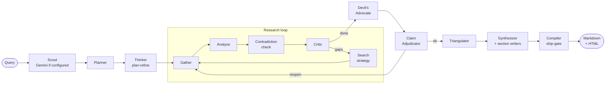

<div align="center">


# 🔍 Providence

### *Autonomous deep research, with receipts.*

**A multi-agent research engine that plans, searches, adversarially reviews, and compiles source-grounded reports — where every claim traces back to a fetched page.**

[](LICENSE)
[](https://python.org)
[](https://github.com/langchain-ai/langgraph)
[](https://fastapi.tiangolo.com)
[](https://nextjs.org)
[](https://docs.astral.sh/uv/)
[](CONTRIBUTING.md)

**No vendor API keys required for the default path** · [Quickstart](#-quickstart) · [Live demo stack](#-web-ui--dashboard) · [Docs](#-docs)

</div>

---

## ✨ Highlights

| | |
|:---|:---|
| 🧾 **Fetched-source ship-gate** | Final references come *only* from pages fetched during the current run — hallucinated URLs are dropped before export. |
| ⚔️ **Adversarial review** | A Devil's Advocate agent hunts counter-evidence; a Socratic Claim Adjudicator re-gathers for weak claims. |
| 🔭 **STORM-style perspectives** | Scout generates diverse perspective lenses that seed counter-queries, the plan pack, and the compiler's "Research perspectives" section. |
| 🧠 **Isolated per-run RAG** | LanceDB + FTS5 hybrid (dense/keyword RRF) — each run gets its own index; writers see only retrieved chunks. |
| 🔌 **Resilient gateway** | Multi-provider routing with circuit breakers, token-bucket rate limits, and automatic failover. Default route is **free** (OpenCode Zen). |
| 🖥️ **Ambient mission-control UI** | Next.js glassmorphism interface with a live progress banner: stage pills, perspective chips, Learned/Gaps feeds, and a collapsible thinking stream. |
| 📊 **Evaluated, not vibed** | Three internal benchmark rounds with per-claim fact-check scoring and reproducible rubrics. |

<div align="center">

```bash
git clone https://github.com/sarv-projects/providence.git && cd providence
bash scripts/install.sh
uv run python main.py research "How does RAG reduce hallucination in LLMs?" --mode standard
```

*Reports land in `reports/` as Markdown + MathJax-rendered HTML.*

</div>

---

Providence is a research system for producing inspectable, source-grounded reports rather than one-shot LLM answers. Its compiler enforces a **fetched-source ship-gate**: final references come only from content received during the current run, and claim support requires URL-attributed verbatim evidence spans.

The live LangGraph pipeline combines planning, iterative retrieval, critique, counter-evidence search, span-based claim verification, RAG-grounded section writing, and citation compilation. It is exposed through both a CLI and a Next.js/FastAPI web application.

Internet access is still required. Add Gemini, Exa, or other providers when you want stronger reasoning, search, or failover options.

### At a glance

| Surface | Purpose |
|---|---|
| CLI | Run research, chat, diagnostics, evaluations, and the Temporal worker |
| Web UI | Chat, background research, plan approval, progress, cancellation, history, vault, and settings |
| API | FastAPI endpoints with typed request bodies, SSE chat streaming, job polling, and cancellation |
| Evidence | Fetched-source ledger, verbatim quote spans, character offsets, claim status, and compiler ship-gate |
| Operations | Provider failover, circuit breakers, retries, rate limits, per-run token/cost accounting, Prometheus metrics |
| Outputs | Markdown and MathJax-rendered HTML reports |

> **Scope note:** provenance is not a guarantee of truth. The system can verify that a quoted span came from a fetched page; source quality, ambiguity, and model judgment still require human review.

---

## 🆕 What's new

- **STORM-style perspective diversity** — the scout now generates a set of distinct analytical perspectives (with a deterministic fallback set), wired into adversary counter-queries, the planner pack, and a new *Research perspectives* section in compiled reports; surfaced live in the UI progress banner as perspective chips.
- **Ambient UI redesign** — full token-based theming (light/dark), gradient orbs, glassmorphism panels, gradient brand/active states, hover-lift cards, and a redesigned 4-row research progress panel with a collapsible color-coded thinking stream.
- **Lenient JSON parsing (`src/jsonutil.py`)** — regex pre-pass + `json-repair` fallback across all agent call sites, so malformed model output no longer crashes a run.
- **OpenCode Zen free is the default primary** — zero-key research end-to-end with automatic failover to keyed providers.

---

## 💪 Capabilities

- Iterative retrieval with a critic that can request another research pass within configured budgets.
- Counter-evidence search and a bounded Socratic re-gather step for weak claims.
- Canonical evidence verification: claims require URL-attributed verbatim spans from fetched content; missing or mismatched spans remain uncertain.
- Per-run hybrid retrieval (LanceDB + FTS5), section-level writing, and a compiler that remaps citations to the final fetched-source list.
- Provider routing with retries, circuit breakers, rate limits, cost/token accounting, and Prometheus metrics.

Reports are written as Markdown and MathJax-rendered HTML. A completed report includes an analysis body, Evidence Bedrock, Research Debt, and a Sources section. When the evidence or budget gate fails, the compiler can produce a blocked/incomplete result instead.

Detailed agent, retrieval, and provider behavior lives in [`docs/ARCHITECTURE.md`](docs/ARCHITECTURE.md) and [`docs/PROVIDERS.md`](docs/PROVIDERS.md).

---

## Table of Contents

- [🎯 Design Goals](#-design-goals)
- [🛠️ Engineering Highlights](#️-engineering-highlights)
- [🏗️ Architecture](#️-architecture)
- [🚀 Quickstart](#-quickstart)
- [🎛️ Research Modes](#️-research-modes)
- [🔑 Providers & Keys](#-providers--keys)
- [⌨️ CLI Reference](#️-cli-reference)
- [🖥️ Web UI & Dashboard](#️-web-ui--dashboard)
- [🔒 Security & Limitations](#-security--limitations)
- [📊 Benchmarks](#-benchmarks)
- [📁 Project Layout](#-project-layout)
- [🧪 Testing](#-testing)
- [📚 Docs](#-docs)
- [🤝 Contributing](#-contributing)
- [📜 License](#-license)

---

## 🎯 Design Goals

| Constraint | Implementation |
|---|---|
| LLMs invent citations | **Compiler ship-gate** — Sources built from this run's fetch log only. Hallucinated URLs and `example.com` placeholders are dropped before export. |
| Confirmation bias | **Adversarial pass** — an explicit Devil's Advocate agent hunts counter-evidence and limitations before synthesis begins. |
| Context-window collapse | **Isolated per-run RAG** — LanceDB + FTS5, dense/keyword RRF. Each run gets its own index; retrieved chunks are the only input to writers. |
| One-shot megaprompt failures | **Parallel section synthesis** — each section is written from its own targeted chunk retrieval. |
| Expensive API lock-in | **Resilient multi-provider gateway** — circuit breakers, token-bucket rate limiters, and automatic failover. The default Zen route does not require a vendor key. |

## 🛠️ Engineering Highlights

The repository is designed to be inspectable, testable, and replaceable at the component boundaries:

| Area | Implementation | Start here |
|---|---|---|
| Orchestration | Typed LangGraph state with bounded research loops and autonomy gates | [`src/graph.py`](src/graph.py), [`src/state.py`](src/state.py) |
| Evidence integrity | One canonical verifier; fetched-source ledger; exact quote spans and offsets | [`src/evidence.py`](src/evidence.py), [`src/engine/agents/compiler.py`](src/engine/agents/compiler.py) |
| Retrieval | Per-run LanceDB/FTS5 hybrid retrieval with guardrails and vault reuse | [`src/rag/pipeline.py`](src/rag/pipeline.py), [`src/rag/hybrid.py`](src/rag/hybrid.py) |
| Reliability | Retry/failover routing, circuit breakers, rate limits, timeouts, and per-run accounting | [`src/gateway/router.py`](src/gateway/router.py), [`src/gateway/providers.py`](src/gateway/providers.py) |
| Product surface | Typed FastAPI API plus Next.js UI with SSE chat, background jobs, progress, and cancellation | [`src/web/__init__.py`](src/web/__init__.py), [`frontend/app/page.tsx`](frontend/app/page.tsx) |
| Verification | Offline integration contracts plus focused gateway and phase suites | [`tests/`](tests/), [`test_gateway.py`](test_gateway.py) |

---

## 🏗️ Architecture

The A4 LangGraph graph (`src/graph.py`):

```
Query
 └─ Scout (Gemini when configured + web peek)
     └─ Planner (Zen) → Thinker plan-refine (Gemini, if enabled)
         └─ Research loop ───────────────────────────────────────┐
             Gather (tool bus: Exa / wiki / scraper / GDELT …)  │
             → Analyze (cluster + extract)                       │
             → Contradiction check (Gemini, if enabled)         │
             → Critic → Search strategy ──── gaps? ─────────────┘
         └─ Devil's Advocate (counter-evidence)
             └─ Claim Adjudicator (Socratic re-gather, 0–1 hop)
                 └─ Triangulator (cross-source consensus)
                     └─ Synthesizer outline → parallel section write (Zen strong)
                         └─ Compiler ← ship-gate
                             ├─ Inference Body     (cited analysis)
                             ├─ Evidence Bedrock   (supported / uncertain / contradicted)
                             ├─ Research Debt      (open gaps, confidence bounds)
                             └─ Sources            (this-run URLs only)
```



**Model tiers** (configured in `config/providers.yaml`):

| Tier | Default | Upgrade with a key |
|---|---|---|
| `fast` — planner, critic, extractors | OpenCode Zen free (`nemotron-3-ultra-free`, `hy3-free`, …) | Groq, OpenAI, DeepSeek |
| `strong` — section writers, synthesizer | OpenCode Zen free | Any provider |
| `thinker` — scout, contradiction check, search strategy | **Gemini Flash** (`GEMINI_API_KEY`) | Gemini only by design |

---

## 🚀 Quickstart

**Requirements:** Python 3.10+, [uv](https://docs.astral.sh/uv/). Node 18+ optional (web UI).

```bash
# 1. Clone and install
git clone https://github.com/sarv-projects/providence.git
cd providence
bash scripts/install.sh          # Windows: .\scripts\install.ps1

# 2. Verify the setup
uv run python main.py doctor

# 3. Run (no vendor API key required)
uv run python main.py research "What are the tradeoffs between SLMs and LLMs?" --mode standard
```

Reports are written to `reports/` as `*.md` and `*.html` (MathJax-rendered).

**Optional keys** — copy `.env.example` and fill in what you have:

```
GEMINI_API_KEY=     # https://aistudio.google.com/apikey  (scout + thinker)
EXA_API_KEY=        # https://exa.ai                      (primary neural search)
FIRECRAWL_API_KEY=  # https://firecrawl.dev               (cloud scraping)
TAVILY_API_KEY=     # https://tavily.com                  (additional search)
```

---

## 🎛️ Research Modes

Pass `--mode <name>`. Default is `standard`.

| Mode | Use | Configured time cap |
|---|---|---|
| `quick` | Short brief with a smaller retrieval budget | 5 min |
| `standard` | Default iterative research | 10 min |
| `deep` | Larger budget with thinker and triangulation enabled | 15 min |
| `academic` | arXiv-prioritized research | 15 min |
| `compare` | Structured comparison matrix | 10 min |
| `recency` | Recency-biased retrieval | 10 min |
| `ultra-long` | Durable long-running research when Temporal is configured | 24 h |
| `chat` | Conversational assistant with research escalation | 2 min |

Time caps come from [`config/modes.yaml`](config/modes.yaml); actual latency depends on providers, search, and network conditions.

**Autonomy levels** (`--autonomy L1|L2|L3`):

| Level | Behaviour |
|---|---|
| `L1` | Fully autonomous end-to-end (default) |
| `L2` | Surfaces clarifying questions, waits for plan approval before gathering |
| `L3` | Unattended batch — strict spend caps and hard export gates |

```bash
uv run python main.py research "Post-quantum cryptography standards survey" \
  --mode academic --autonomy L2
```

---

## 🔑 Providers & Keys

All LLM calls go through `src/gateway/` — circuit breakers, RPM/TPM token-bucket rate limiters, jitter retry, automatic failover. No LiteLLM process.

**Default path (no vendor API key):**
- Workhorse: `nemotron-3-ultra-free` → `hy3-free` → `nemotron-3.5-lightning-free` → `big-pickle` (reasoning)
- Search: DuckDuckGo + Trafilatura + Wikipedia + GDELT
- Embeddings: local bag-of-words

**Optional keys (each upgrades one layer independently):**

| Key | What it unlocks |
|---|---|
| `GEMINI_API_KEY` | Thinker tier — scout, contradiction detection, search strategy |
| `EXA_API_KEY` | Neural search with full page text |
| `FIRECRAWL_API_KEY` | Cloud scraping (local scraper is the fallback) |
| `TAVILY_API_KEY` | Additional search/extract endpoint |
| `NEWSDATA_API_KEY` | Newswire access |
| `EMBEDDING_API_KEY` / `USE_CHAT_KEY_FOR_EMBEDDINGS=1` | Dense vector embeddings |
| `GROQ_API_KEY`, `OPENAI_API_KEY`, `ANTHROPIC_API_KEY`, … | Override Zen free on `fast`/`strong` tiers |

Full catalog: [`config/providers.yaml`](config/providers.yaml) · [`docs/PROVIDERS.md`](docs/PROVIDERS.md)

---

## ⌨️ CLI Reference

```bash
# Research
uv run python main.py research "topic"
uv run python main.py research "Rust vs Go for high-throughput services" --mode compare
uv run python main.py research "Latest solid-state battery developments" --mode recency
uv run python main.py research "Survey of homomorphic encryption" --mode academic --autonomy L2
uv run python main.py research "What is a transformer?" --mode quick

# Interactive chat  (/research <topic> escalates mid-session)
uv run python main.py chat

# System
uv run python main.py doctor       # live provider health + tool readiness
uv run python main.py --history    # past runs and report paths

# Server & worker
uv run python main.py server       # FastAPI on :8001 (docs at /docs)
uv run python main.py worker       # Temporal durable worker (ultra-long mode)

# Evaluation
uv run python main.py eval all
```

---

## 🖥️ Web UI & Dashboard

The frontend is a **Next.js 14** app (`frontend/`) wired to the FastAPI backend via rewrites. In local development, `/api/*` requests are proxied to `localhost:8001` by `next.config.mjs`.

### Launch the full dev stack

```bash
bash scripts/start-dev.sh
# API → http://localhost:8001   (Swagger at /docs)
# UI  → http://localhost:3000
```

Or separately:

```bash
# Terminal 1 — Python backend
uv run python main.py server

# Terminal 2 — Next.js frontend
cd frontend && npm run dev
```

> **Custom backend port:** set `BACKEND_URL=http://localhost:PORT` before starting Next.js.

### Pages & features

| Route | What it does |
|---|---|
| `/` | Main interface — Chat mode and Research mode in one view |
| `/settings` | Engine & gateway configuration — model picker, mode defaults, budgets |
| `/history` | Past research runs with links to generated reports |
| `/vault` | Research Vault — on-topic past sources reused across sessions |

### Main interface (`/`)

**Chat mode** — streams responses token-by-token via SSE. May escalate long or research-heavy queries using the configured heuristic.

**Research mode** — dispatches a background job to the A4 pipeline and shows a live **ProgressBanner** while it runs:
- Status line: current stage, elapsed seconds, findings count, sources count
- **Next action** — what the agent is about to do
- **Learned** — last 4 facts extracted from retrieved pages
- **Gaps** — open questions the Critic identified for the next loop
- **Thinking stream** — raw agent thought log (kind + text)

**Mode & autonomy selectors** inline in the input bar:
- Dropdown for all 8 modes (`quick` → `ultra-long`)
- Dropdown for autonomy: `L1 auto` / `L2 plan review` / `L3 hard budget`
- `Edit plan first` checkbox — triggers the plan editor at L1 too

**Plan editor (L2 / "Edit plan first")** — when a plan is generated before research begins, an editable panel appears with:
- Clarifying questions from the planner (with text input for answers)
- Outline sections (one per line, editable textarea)
- Search queries (one per line, editable textarea)
- **Approve & research** sends the edited plan and starts the job

**Approval banner** — for L3 workflow gates: polls `/api/approvals` every 10s and surfaces pending gates at the top of the screen with Approve / Reject buttons.

### Settings page (`/settings`)

- **Model picker** — expandable provider groups (OpenCode Zen free first), live probe buttons per provider, status (ok/fail/latency), model selection
- **LLM providers** — registered provider catalog, + Add Provider form (name, endpoint, API key, model list)
- **Research mode defaults** — default mode profile and autonomy level
- **Budget controls** — max cost cap (USD) and max graph iterations
- Save All Settings persists to the backend `/api/settings`

### Tech stack (frontend)

| Package | Role |
|---|---|
| Next.js 14 | Framework, routing, SSR |
| React 18 | UI |
| Tailwind CSS 3 | Styling |
| `react-markdown` + `remark-gfm` | Markdown rendering with GFM tables, code blocks |
| `remark-math` + `rehype-katex` | LaTeX / MathJax rendering in assistant messages |
| `katex` | Math display engine |
| `lucide-react` | Icons |
| `clsx` + `tailwind-merge` | Conditional class utilities |

### Gateway ops dashboard

```bash
uv run python -m src.dashboard --port 8080
# http://localhost:8080
```

| Endpoint | What it shows |
|---|---|
| `/` | Metrics UI — token spend, route health, circuit states |
| `/api/status` | JSON — gateway status + tool-bus `search_cache` |
| `/api/events` | SSE — live gateway events |
| `/metrics` | Prometheus-format metrics |

---

## 🔒 Security & Limitations

- **No production authentication is included by default.** The development API enables permissive CORS and should sit behind an authenticated reverse proxy before public deployment.
- **Treat external content as untrusted input.** The renderer escapes report text, validates outbound link schemes, and the scraper blocks private/link-local destinations; still review provider and deployment settings before exposing the service.
- **Keys stay in environment variables.** Do not commit `.env`, provider secrets, generated reports, or local databases.
- **Evidence is traceability, not truth.** A supported claim has a matching quote span from a fetched source; it is not a substitute for source-quality assessment or domain-expert review.
- **External dependencies affect results.** Search coverage, provider availability, rate limits, model behavior, and network access affect latency and accuracy.
- **Temporal is optional.** Without a running Temporal server, `ultra-long` uses the in-process fallback and does not survive a process restart.

For a vulnerability report, see [`SECURITY.md`](SECURITY.md). For changes, see [`CONTRIBUTING.md`](CONTRIBUTING.md).

---

## 📊 Benchmarks

**Internal topic suite** — scored against independently researched ground truth across geopolitical, scientific, financial, and technology domains. Fact-check accuracy **varies by round** (suite size and configuration differed per round — see each file for its protocol):

| Round | Fact-check accuracy | Report |
|---|---|---|
| R1 (15 topics, Groq + Exa, `standard`) | **0.86** (76 / 91 verified points) | [RESEARCH_BENCHMARK.md](benchmarks/RESEARCH_BENCHMARK.md) |
| R2 (11 topics) | **0.81** | [RESEARCH_BENCHMARK_R2.md](benchmarks/RESEARCH_BENCHMARK_R2.md) |
| R3 (latest, comparable topics) | **0.77** | [RESEARCH_BENCHMARK_R3.md](benchmarks/RESEARCH_BENCHMARK_R3.md) |

> **Benchmark scope:** fact accuracy was **86%** in Round 1; the latest repeated-subset result is **~77%** in Round 3. These rounds differ in topic count and configuration, so treat them as internal regression measurements, not a general accuracy guarantee. See the per-round reports for the scoring method and limitations.

> On the free Zen + Gemini scout stack, `standard` typically runs 12–18 min. The R1 averages above used Groq + Exa.

Full per-topic rubrics, fact-check matrices, and three scoring rounds: [`benchmarks/RESEARCH_BENCHMARK.md`](benchmarks/RESEARCH_BENCHMARK.md)

**DeepResearch Bench (100-task DRB)** — self-hosted runner and local RACE-style scoring workflow. External system scores are not reproduced here and should not be treated as a direct comparison. Full protocol: [`score.md`](score.md)

---

## 📁 Project Layout

```
main.py                     CLI entrypoint
config/
  modes.yaml                Budgets, token limits, quality dials per mode
  providers.yaml            Provider catalog, model lists, tier routing
src/
  graph.py                  LangGraph A4 pipeline
  state.py                  Typed ResearchState
  evidence.py               Canonical quote-span verifier
  llm.py                    call_llm() → gateway dispatch
  engine/
    agents/                 planner  researcher  thinker  critic
                            adversary  triangulator  synthesizer  compiler
    modes.py                Mode + budget resolution
    temporal/               Optional Temporal worker (ultra-long)
  gateway/                  router  circuit  ratelimit  metrics  keys
  rag/                      LanceDB+FTS5  hybrid-RRF  guard  vault  factoids
  tools/
    adapters/               exa  firecrawl  wikipedia  gdelt
                            tavily  newsdata  builtin-scraper
                            mineru  nougat  llamaparse (PDF)
  render/                   MathJax / LaTeX HTML rendering
  web/                      FastAPI app + SSE streaming
  dashboard/                Gateway ops dashboard
frontend/                   Next.js 14 UI
tests/                      Offline integration contracts
benchmarks/                 Scoring scripts, ground truth, benchmark reports
docs/                       Architecture, providers, gateway, install
reports/                    Generated *.md + *.html output
CONTRIBUTING.md             Development and pull-request workflow
SECURITY.md                 Vulnerability reporting and deployment warnings
```

---

## 🧪 Testing

```bash
uv run python test_phase_a.py     # provider catalog, gateway Zen-free integration
uv run python test_phase_b.py     # planner, researcher node contracts
uv run python test_phase_c.py     # RAG retrieval, citation integrity
uv run python test_phase_c2.py    # thinker tier and graph integration
uv run python test_phase_d.py     # tool bus + live adapter integration (network-aware)
uv run python test_phase_e.py     # claim adjudication, Socratic hop
uv run python test_phase_f.py     # triangulator
uv run python test_phase_g.py     # synthesizer outline + section write
uv run python test_phase_h.py     # compiler ship-gate, citation remapping
uv run python test_phase_i.py     # export: markdown, HTML
uv run python test_phase_l.py     # ultra-long / Temporal path
uv run python test_gateway.py     # gateway routing, circuits, failover
uv run python -m unittest discover -s tests -p 'test_*.py'  # offline integration contracts

cd frontend && npm run lint && npm run build

uv run python main.py eval all    # full component + system suite
```

> **Offline / CI:** suites that need live network (e.g. `test_phase_d.py`) skip
> cleanly — with exit code 0 — when DNS is unavailable or when
> `PROVIDENCE_OFFLINE=1` is set, instead of hanging.

---

## 📚 Docs

| Doc | Purpose |
|---|---|
| [INSTALL.md](docs/INSTALL.md) | Environment setup, keys, platform notes, troubleshooting |
| [ARCHITECTURE.md](docs/ARCHITECTURE.md) | Agent contracts, RAG pipeline, compiler ship-gate rules |
| [PROVIDERS.md](docs/PROVIDERS.md) | Zen free model IDs, Gemini setup, optional paid providers |
| [GATEWAY.md](docs/GATEWAY.md) | Circuit-breaker mechanics, rate limiting, ops dashboard |

## 🤝 Contributing

Bug reports, focused improvements, and reproducible evaluation results are welcome. Start with [`CONTRIBUTING.md`](CONTRIBUTING.md); security issues belong in [`SECURITY.md`](SECURITY.md), not public issues.

---

## 📜 License

[MIT](LICENSE)
